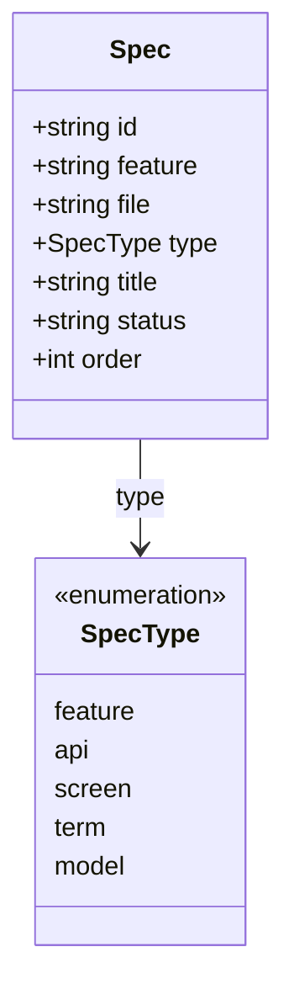
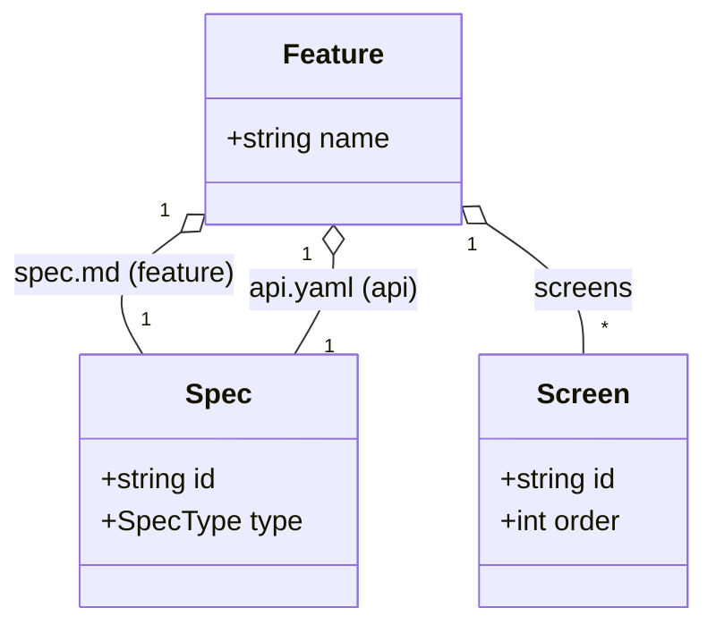
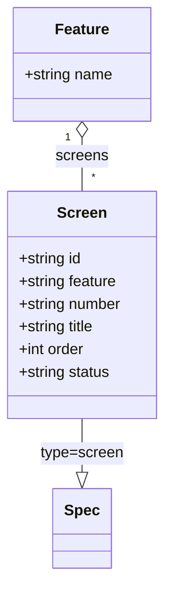

# specs Web UI デザイン依頼プロンプト

あなたはプロダクトデザイナーです。以下のローカル CLI ツール付属の Web UI を、
情報設計はほぼ維持しつつ、ビジュアルと UX を刷新したデザイン案として提案してください。
モックには末尾「付録: 実データ」の実際の仕様書内容をそのまま使ってください
（ダミーテキストは使わない）。

## プロダクト概要
- 名前: specs / specs-cli
- 何か: ソフトウェアの「仕様書」を Markdown / YAML ファイル（`specs/` 配下）で
  ローカル管理する CLI ツール。`specs serve` で起動するローカル Web UI から
  一覧・詳細・作成・編集・削除・並び替えを行う。
- 思想: ローカルファースト。Markdown ファイルが唯一の正（DB なし）。git で差分が
  取れ、Obsidian でも開ける。認証なし（127.0.0.1 で 1 人が使う前提）。
- ユーザー: エンジニア / PM。ダッシュボードではなく「ドキュメントを読み書きする」道具。

## 情報設計（現状の画面構成・維持してよい）
2 ペイン構成。
- ヘッダー: ロゴ「📑 specs」＋ 右に「＋ 新規 feature」ボタン。
- 左サイドバー（幅 ~320px）: ツリー状の一覧。上から以下のグループ。
  1. **Product**: vision / principles（type=product）
  2. **Domain**: Ubiquitous Language（用語, type=term）と Models（type=model）。
     各セクションに「＋ 用語」「＋ モデル」ボタン。
  3. **feature ごとのグループ**（feature 名見出し）: spec.md(type=feature) /
     api.yaml(type=api) のドキュメントに加え、**Screens** サブリスト
     （type=screen, 「＋ 画面」ボタン、ドラッグ&ドロップで並び替え）。
  各項目はラベル＋ type バッジ。選択中はハイライト。
- 右メイン（最大幅 ~900px）: 選択した仕様書の詳細。種別で表示を出し分ける。
  - Markdown（product / feature / screen / term）: frontmatter をメタ情報ブロックとして
    区別し、本文を整形表示。
  - model: 本文中の mermaid コードブロックを図としてレンダリング。
  - api.yaml: OpenAPI 3.1 を「軽量ビュー」で表示（servers / paths＋メソッド色分け
    バッジ / 各オペレーションの summary・params・responses / components.schemas 一覧）。
  - 上部ツールバー: 「編集」ボタン、（product 以外は）「削除」ボタン。
  - 編集モード: 等幅フォントの textarea で Markdown/YAML を直接編集 → 「保存」「キャンセル」。
    api.yaml は保存時に OpenAPI スキーマ検証（不正ならエラー表示し保存しない）。

## コンテンツ種別（データモデル）
すべて 1 ファイル = 1 ドキュメント（`Spec`）。`type` で表示が変わる。

| type      | 置き場所                         | 表示              | 例 |
|-----------|----------------------------------|-------------------|----|
| product   | `product/*.md`                   | Markdown          | vision.md / principles.md |
| feature   | `features/<f>/spec.md`           | Markdown          | Feature: Specs Management |
| api       | `features/<f>/api.yaml`          | OpenAPI 軽量ビュー | Specs Management API |
| screen    | `features/<f>/screens/S-00n.md`  | Markdown          | 仕様書一覧画面 |
| term      | `domain/glossary/<name>.md`      | Markdown          | 仕様書 |
| model     | `domain/models/<name>.md`        | Markdown＋mermaid 図 | Spec / Feature / Screen |

Markdown ファイルは先頭に YAML frontmatter（`id` / `type` / `status` /
screen は `feature` / `order` など）を持つ。

## 主要インタラクション
- 一覧から項目選択 → 詳細表示（URL ハッシュで状態保持）。
- 新規作成: feature / 画面 / 用語 / モデル をモーダル（名前入力）で作成。
- 編集（インライン textarea）/ 保存 / 削除。
- 画面のドラッグ&ドロップ並び替え（同一 feature 内）。
- 通知: 右下トースト（「保存しました」「並び順を保存しました」/ エラー 等）。

## 現状のビジュアル（参考・刷新対象）
- Notion 風のミニマルなライトテーマ。
- 配色: 背景 `#fbfbfa` / パネル `#fff` / 枠線 `#e6e6e3` / 文字 `#2b2b2a` /
  ミュート `#8a8a82` / アクセント青 `#3a6df0` / 危険 `#d3463a`。
- OpenAPI メソッド色: GET `#3a6df0` / POST `#2e9e5b` / PUT `#c2810f` /
  PATCH `#7a51d6` / DELETE `#d3463a`。
- 角丸 7–12px、薄い枠線中心、影はほぼなし。日本語含む（システムフォント）。

## デザインで実現してほしいこと
- 「読む」ことに集中できる静かなドキュメント体験。情報密度は高めだが圧迫しない。
- サイドバーの階層（Product / Domain / features ＞ Screens）が直感的に把握でき、
  type バッジで種別が一目で分かる。
- 詳細ペインの 4 表示モード（Markdown / mermaid / OpenAPI / 編集）それぞれに
  最適化された読みやすいレイアウト。特に OpenAPI 軽量ビューを見やすく。
- ライト / ダークテーマ両対応。
- 空状態（未選択・0件）、ローディング、エラー、編集中などの状態デザイン。
- レスポンシブ（狭幅でサイドバーを折りたたみ可能に）。

## 制約
- 実装は React + Vite + TypeScript（Go バイナリに埋め込み配信）。
  既存スタックで実現できる範囲（複雑な独自描画やアニメ多用は避ける）。
- マークダウン描画は react-markdown、図は mermaid を使用。
- 派手さより、開発ツールとしての信頼感・可読性・素早い操作を優先。

## 成果物
1. デザインの方向性（コンセプト / トーン）の短い説明。
2. 主要画面のモックアップ（付録の実データを使用）:
   - 一覧＋詳細（Markdown 表示。例: `product/vision.md` または feature spec）
   - 詳細（OpenAPI 軽量ビュー。例: Specs Management API）
   - 詳細（mermaid モデル図。例: `domain/models/Spec.md`）
   - 編集モード
   - 作成モーダル
   - ライト / ダーク両方（少なくともキー画面）
3. カラートークン / タイポグラフィ / 余白・角丸などの簡単なデザイントークン。
4. 必要なら改善提案（現状 IA への具体的な指摘）。

---

# 付録: 実データ（モックに使用）

## 現状のサイドバー一覧（実際の表示ツリー）

```
Product
  Vision                         (product/vision.md · product)
  Product Principles             (product/principles.md · product)

Domain
  Ubiquitous Language
    仕様書                        (domain/glossary/仕様書.md · term)
    ページ仕様書                  (domain/glossary/ページ仕様書.md · term)
  Models
    Feature                      (domain/models/Feature.md · model)
    Screen                       (domain/models/Screen.md · model)
    Spec                         (domain/models/Spec.md · model)

domain-management
  spec.md                        (feature)
  api.yaml                       (api · Domain Management API)
  Screens
    ユビキタス言語一覧画面         (S-001 · screen)
    モデル一覧画面                (S-002 · screen)

product
  spec.md                        (feature)
  api.yaml                       (api · Product API)
  Screens
    ビジョン画面                  (S-001 · screen)
    プリンシパル画面              (S-002 · screen)

specs-management
  spec.md                        (feature)
  api.yaml                       (api · Specs Management API)
  Screens
    仕様書一覧画面                (S-001 · screen)
    仕様書詳細画面                (S-002 · screen)
```

> 並び順: Product → Domain → feature 名昇順。feature 内は spec.md → api.yaml →
> Screens（order 昇順）。Product 内は Vision を先頭に表示。

## 作成モーダルのコピー（実データ）

| 種別    | タイトル          | ヒント | プレースホルダ |
|---------|-------------------|--------|----------------|
| feature | 新規 feature      | 英数字 . _ - が使えます。spec.md と api.md が生成されます。 | feature 名 (例: user-login) |
| screen  | 画面を追加 — <feature> | 画面名を入力。S-00n が自動採番され screens/ に生成されます。 | 画面名 (例: ログイン画面) |
| term    | 用語を追加        | ユビキタス言語を domain/glossary/ に作成します。 | 用語名 (例: 仕様書) |
| model   | モデルを追加      | mermaid 記法のモデルを domain/models/ に作成します。 | モデル名 (例: User) |

## ファイル内容（実データ・全文）

### specs/product/vision.md

````markdown
---
id: product.vision
type: product
status: draft
---

# Vision

## Background

AI時代の仕様書管理をアップデートしたい。

## Purpose

ローカルファーストな仕様書管理CLI。
CLI経由での作成・更新が可能。
Web Viewも。

## Target Users

エンジニア

## Value Proposition

仕様書がちらばったり、管理されていない状態にならない。

## Non-goals

<!-- 初期スコープから外すもの -->

````

### specs/product/principles.md

````markdown
---
id: product.principles
type: product
status: draft
---

# Product Principles

## Principle 1

シンプルなツールに


````

### specs/domain/glossary/仕様書.md

````markdown
---
id: domain.glossary.仕様書
type: term
status: draft
---

# 仕様書

## Definition

API仕様書とページ仕様書のこと

## Notes

<!-- 補足 -->

## Related

<!-- 関連する用語・Feature -->

````

### specs/domain/glossary/ページ仕様書.md

````markdown
---
id: domain.glossary.ページ仕様書
type: term
status: draft
---

# ページ仕様書

## Definition

画面の設計についての仕様書
そのページで何ができるのか、どういうUIがあるのか、アクセス権限など

## Notes

<!-- 補足 -->

## Related

<!-- 関連する用語・Feature -->

````

### specs/domain/models/Spec.md

````markdown
---
id: domain.models.Spec
type: model
status: draft
---

# Spec

## Description

仕様書 (specs/ 配下の 1 つの Markdown ファイル) を表す基底モデル。実装の `store.Spec` に対応する。
`type` によって役割が分かれ、`screen` などは Spec の特化として別モデルに切り出している。

- `id`: specs/ からの相対パス。一意キー（例: `features/user-login/spec.md`）
- `feature`: 所属する feature 名（domain エントリでは空）
- `file`: ファイル名（spec.md / api.yaml / S-00n.md / 用語名.md など）
- `type`: 種別。`feature` / `api` / `screen` / `term` / `model`
- `title`: 先頭の H1 見出し
- `status`: frontmatter の status（draft など）
- `order`: 並び順（screen で使用）

関連: [Feature](Feature.md)（spec.md / api.yaml / screens を束ねる）、[Screen](Screen.md)（type=screen の特化）。

## Diagram



````

### specs/domain/models/Feature.md

````markdown
---
id: domain.models.Feature
type: model
status: draft
---

# Feature

## Description

機能 (`features/<name>/`) を表すアグリゲート。
1 つの feature 仕様 (`spec.md`, type=feature)、1 つの API 仕様 (`api.yaml`, type=api)、
複数の画面 ([Screen](Screen.md), `screens/`) を束ねる。

- `name`: feature 名（ディレクトリ名。英数字 `.` `_` `-`）

構成要素はすべて [Spec](Spec.md)（の特化）として表現される。

## Diagram



````

### specs/domain/models/Screen.md

````markdown
---
id: domain.models.Screen
type: model
status: draft
---

# Screen

## Description

画面仕様 (`features/<feature>/screens/S-00n.md`, type=screen) を表すモデル。
[Spec](Spec.md) の特化で、[Feature](Feature.md) に属する。

- `id`: specs/ からの相対パス
- `feature`: 所属する feature 名
- `number`: 画面番号（ファイル名先頭の `S-00n`、追加時に自動採番）
- `title`: 画面名（H1 見出し）
- `order`: feature 内の並び順（frontmatter の order。ドラッグ&ドロップで更新）
- `status`: frontmatter の status

## Diagram



````

### specs/features/product/spec.md

````markdown
---
id: feature.product
type: feature
status: draft
related:
  - domain.glossary
  - domain.models
---

# Feature: Product

## Overview

プロダクトのビジョンやプリンシパルを管理するページ

## Users

PM

## Scope

### Included

- ビジョン (`product/vision.md`) の閲覧・編集
- プリンシパル (`product/principles.md`) の閲覧・編集

### Excluded

- product ドキュメントの新規作成・削除（`specs init` が生成する 2 ファイルを編集するのみ）
- 認証・認可（ローカル実行のため不要）

## Requirements

### R-001 管理対象

product 配下の以下 2 ファイルを管理する。いずれも frontmatter `type: product` の Markdown。

- `product/vision.md`: プロダクトのビジョン
- `product/principles.md`: プロダクトのプリンシパル

これらは `specs init` で雛形を生成する。

### R-002 閲覧

ローカル Web UI のサイドバー「Product」セクションに、ビジョンを先頭、続けて
プリンシパルを表示する。項目を選択すると本文を Markdown として整形表示する。

### R-003 編集

詳細画面で編集モードに切り替え、本文（Markdown テキスト）を上書き保存できる。
保存後は一覧のメタ情報（title）も更新される。

### R-004 制約

product ドキュメントの新規作成・削除は提供しない（詳細画面に削除ボタンを出さない）。
ID（specs/ からの相対パス）はパストラバーサルを禁止し、`product/` 配下かつ
`.md` で終わるパスのみを受け付ける。

## Screens

画面は `screens/` 配下に 1 画面 1 ファイル（type: screen）で管理する。

- [S-001 ビジョン画面](screens/S-001.md)
- [S-002 プリンシパル画面](screens/S-002.md)

````

### specs/features/product/api.yaml

````yaml
openapi: 3.1.0
info:
  title: Product API
  version: 0.1.0
  description: |
    Product の API 仕様。
servers:
  - url: /api
paths:
  /product:
    get:
      summary: 一覧取得
      operationId: list_product
      responses:
        "200":
          description: OK
          content:
            application/json:
              schema:
                type: array
                items:
                  $ref: "#/components/schemas/product"
components:
  schemas:
    product:
      type: object
      properties:
        id:
          type: string
      required:
        - id

````

### specs/features/product/screens/S-001.md

````markdown
---
id: feature.product.screen.S-001
type: screen
feature: product
order: 1
status: draft
---

# Screen: ビジョン画面

## Purpose

`product/vision.md` の閲覧・編集ができる。

## Fields

- Background（なぜこのプロダクトが必要か）
- Purpose（何を実現するか）
- Target Users（誰のためのプロダクトか）
- Value Proposition（どのような価値を提供するか）
- Non-goals（初期スコープから外すもの）

## Actions

- 本文を Markdown として整形表示する
- 「編集」で編集モードへ切り替える
- 「保存」で本文を上書き保存する / 「キャンセル」で破棄する

## Errors

- 取得失敗時はトーストでメッセージを表示する
- 保存失敗時はトーストを表示し編集モードを維持する

````

### specs/features/product/screens/S-002.md

````markdown
---
id: feature.product.screen.S-002
type: screen
feature: product
order: 2
status: draft
---

# Screen: プリンシパル画面

## Purpose

`product/principles.md` の閲覧・編集ができる。

## Fields

- Principle N（判断基準となる原則）

## Actions

- 本文を Markdown として整形表示する
- 「編集」で編集モードへ切り替える
- 「保存」で本文を上書き保存する / 「キャンセル」で破棄する

## Errors

- 取得失敗時はトーストでメッセージを表示する
- 保存失敗時はトーストを表示し編集モードを維持する

````

### specs/features/domain-management/spec.md

````markdown
---
id: feature.domain-management
type: feature
status: draft
related:
  - domain.glossary
  - domain.models
---

# Feature: Domain Management

## Overview

ドメインを管理する

## Users

PM、エンジニア

## Scope

### Included

- ユビキタス言語の管理
- モデルの管理

### Excluded

-

## Requirements

### R-001 モデルの表示

モデルはmermaidの記法で書く。表示もmermaidのpreviewで表示されるようにする。

### R-002 データ構造

ユビキタス言語は `domain/glossary/<term>.md` (type: term)、
モデルは `domain/models/<model>.md` (type: model) として 1 件 1 ファイルで管理する。
名前に日本語を許可し、パス区切り (`/` `\`) や `.` 始まりの名前は禁止する。

### R-003 ユビキタス言語の管理

一覧・詳細・追加・編集・削除ができる。
追加は CLI `specs new term <name>`、または Web UI の「+ 用語」から。

### R-004 モデルの管理

一覧・詳細・追加・編集・削除ができる。
追加は CLI `specs new model <name>`、または Web UI の「+ モデル」から。
モデルファイルは説明 + mermaid コードブロックを持ち、詳細画面で mermaid を描画する。

## Screens

画面は `screens/` 配下に 1 画面 1 ファイル（type: screen）で管理する。

- [S-001 ユビキタス言語一覧画面](screens/S-001.md)
- [S-002 モデル一覧画面](screens/S-002.md)

````

### specs/features/domain-management/api.yaml

````yaml
openapi: 3.1.0
info:
  title: Domain Management API
  version: 0.1.0
  description: |
    ドメイン (ユビキタス言語・モデル) を管理する API。
    一覧・詳細・更新・削除は Specs Management API の /specs を利用する
    (domain エントリの id は domain/glossary/<term>.md / domain/models/<model>.md)。
    本仕様では domain 固有の作成エンドポイントを定義する。
servers:
  - url: /api
paths:
  /domain/terms:
    post:
      summary: ユビキタス言語の作成
      operationId: createTerm
      requestBody:
        required: true
        content:
          application/json:
            schema:
              $ref: "#/components/schemas/CreateRequest"
      responses:
        "201":
          $ref: "#/components/responses/Created"
        "400":
          $ref: "#/components/responses/Error"
  /domain/models:
    post:
      summary: モデルの作成 (mermaid テンプレート)
      operationId: createModel
      requestBody:
        required: true
        content:
          application/json:
            schema:
              $ref: "#/components/schemas/CreateRequest"
      responses:
        "201":
          $ref: "#/components/responses/Created"
        "400":
          $ref: "#/components/responses/Error"
components:
  responses:
    Created:
      description: Created
      content:
        application/json:
          schema:
            type: object
            properties:
              created:
                type: string
            required:
              - created
    Error:
      description: エラー
      content:
        application/json:
          schema:
            type: object
            properties:
              error:
                type: string
            required:
              - error
  schemas:
    CreateRequest:
      type: object
      properties:
        name:
          type: string
      required:
        - name

````

### specs/features/domain-management/screens/S-001.md

````markdown
---
id: feature.domain-management.screen.S-001
type: screen
feature: domain-management
order: 1
status: draft
---

# Screen: ユビキタス言語一覧画面

## Purpose

ユビキタス言語を一覧で見れる画面。

## Fields

- 用語名（一覧）
- Definition / Notes / Related（詳細）

## Actions

- ユビキタス言語の追加（「+ 用語」）
- ユビキタス言語の編集（詳細画面で編集 → 保存）
- ユビキタス言語の削除

## Errors

-

````

### specs/features/domain-management/screens/S-002.md

````markdown
---
id: feature.domain-management.screen.S-002
type: screen
feature: domain-management
order: 2
status: draft
---

# Screen: モデル一覧画面

## Purpose

モデルが一覧で表示される

## Fields

- モデル名（一覧）
- Description（詳細）
- mermaid 図（詳細・preview 描画）

## Actions

- モデルの追加（「+ モデル」）
- モデルの編集（詳細画面で編集 → 保存）
- モデルの削除

## Errors

-

````

### specs/features/specs-management/spec.md

````markdown
---
id: feature.specs-management
type: feature
status: draft
related:
  - domain.glossary
  - domain.models
---

# Feature: Specs Management

## Overview

仕様書を管理する。仕様書とはfeature配下のmdを差す。
ローカルファーストな思想に基づき、`specs serve` で起動するローカルWeb UIから
仕様書の一覧・詳細・作成・更新・削除・並び替えを行う。

## Users

エンジニア

## Scope

### Included

- 仕様書の一覧閲覧
- 仕様書の新規作成
- 仕様書の削除
- 仕様書の詳細閲覧
- 仕様書の更新
- 仕様書の並び変え

- 画面（Screen）の管理（追加・並び替え・編集・削除）

### Excluded

- 認証・認可（ローカル実行のため不要）
- 仕様書本体（spec.md / api.yaml）の任意単体追加（作成はfeature単位）
- WYSIWYGエディタ（編集はMarkdownテキストで行う）
- DBによる管理（Markdownファイルを唯一の正とする）

## Requirements

### R-001 仕様書の対象範囲

仕様書として扱うのは以下とする。

- `features/<feature>/spec.md`（type: feature）
- `features/<feature>/api.yaml`（type: api / OpenAPI 3.1）
- `features/<feature>/screens/*.md`（type: screen）
- `domain/glossary/*.md`（type: term）, `domain/models/*.md`（type: model）
- `product/*.md`（type: product）— ビジョン / プリンシパル（[product feature](../product/spec.md) が管理）

### R-002 ローカルWeb UIの起動

`specs serve [--addr host:port]` でローカルHTTPサーバを起動する。
デフォルトの待受は `127.0.0.1:8787`。
specs/ が未初期化の場合はエラーを表示し、`specs init` を促す。

### R-003 一覧の表示

仕様書を feature 単位でグループ化して表示する。
各項目は ファイル名・type（frontmatterのtype）を表示する。

### R-004 詳細の表示

仕様書を種別に応じて整形表示する。

- Markdown（spec.md / screen / term）: frontmatter をメタ情報として区別し本文を描画
- model: mermaid コードブロックを図として描画
- api.yaml: OpenAPI として paths / operations / schemas を軽量ビューで表示

### R-005 更新

詳細画面で編集モードに切り替え、本文（Markdown / YAML テキスト）を上書き保存できる。
api.yaml は保存前に **OpenAPI スキーマ検証**を行い、不正な場合はエラーを表示して保存しない。
保存後は一覧のメタ情報（title など）も更新される。

### R-006 新規作成

- feature 作成: feature 名を入力すると `spec.md` / `api.yaml`（OpenAPI 3.1 雛形）を生成する。
  CLI の `specs new feature <name>` と同一の生成ロジック・テンプレートを用いる。
  feature 名に使えるのは英数字・`.`・`_`・`-` のみ。
- 画面作成: feature を指定して画面を追加すると `screens/S-00n[-<slug>].md`
  を生成する。番号 (S-00n) と order は既存画面の次の値を自動採番する。
  CLI は `specs new screen <feature> <name>`。

### R-007 削除

仕様書ファイルを削除する。削除によって `screens/` や feature 配下が
空になった場合は当該ディレクトリも削除する（`features/` 自体は残す）。

### R-008 画面の並び替え

一覧上のドラッグ&ドロップで同一 feature 内の画面の表示順を変更できる。
並び順は各画面ファイルの frontmatter の `order` に永続化する。
一覧は domain → feature 昇順 → feature 内は spec.md, api.yaml, その後 screen を
order 昇順で表示する。

### R-009 安全性

ID（specs/ からの相対パス）はパストラバーサルを禁止し、
管理対象ルート（`product/`, `features/`, `domain/glossary/`, `domain/models/`）配下かつ
`.md` / `.yaml` で終わるパスのみを受け付ける。

## Screens

画面は `screens/` 配下に 1 画面 1 ファイル（type: screen）で管理する。

- [S-001 仕様書一覧画面](screens/S-001.md)
- [S-002 仕様書詳細画面](screens/S-002.md)

````

### specs/features/specs-management/api.yaml

````yaml
openapi: 3.1.0
info:
  title: Specs Management API
  version: 0.1.0
  description: |
    仕様書 (specs/ 配下の md / yaml) を管理する API。
    `{id}` は specs/ からの相対パス (例: features/user-login/spec.md)。
servers:
  - url: /api
paths:
  /specs:
    get:
      summary: 仕様書一覧の取得
      operationId: listSpecs
      responses:
        "200":
          description: OK
          content:
            application/json:
              schema:
                type: object
                properties:
                  specs:
                    type: array
                    items:
                      $ref: "#/components/schemas/Spec"
  /specs/{id}:
    parameters:
      - $ref: "#/components/parameters/SpecId"
    get:
      summary: 仕様書詳細の取得
      operationId: getSpec
      responses:
        "200":
          description: OK
          content:
            application/json:
              schema:
                type: object
                properties:
                  spec:
                    $ref: "#/components/schemas/Spec"
                  content:
                    type: string
        "404":
          $ref: "#/components/responses/Error"
    put:
      summary: 仕様書の更新
      description: api.yaml の場合は保存前に OpenAPI スキーマ検証を行う。
      operationId: updateSpec
      requestBody:
        required: true
        content:
          application/json:
            schema:
              type: object
              properties:
                content:
                  type: string
              required:
                - content
      responses:
        "200":
          $ref: "#/components/responses/Ok"
        "400":
          $ref: "#/components/responses/Error"
        "404":
          $ref: "#/components/responses/Error"
    delete:
      summary: 仕様書の削除
      operationId: deleteSpec
      responses:
        "200":
          $ref: "#/components/responses/Ok"
        "404":
          $ref: "#/components/responses/Error"
  /features:
    post:
      summary: feature の作成 (spec.md / api.yaml を生成)
      operationId: createFeature
      requestBody:
        required: true
        content:
          application/json:
            schema:
              type: object
              properties:
                name:
                  type: string
              required:
                - name
      responses:
        "201":
          description: Created
          content:
            application/json:
              schema:
                type: object
                properties:
                  created:
                    type: array
                    items:
                      type: string
        "400":
          $ref: "#/components/responses/Error"
  /features/{feature}/screens:
    parameters:
      - $ref: "#/components/parameters/Feature"
    post:
      summary: 画面の作成 (screens/S-00n.md)
      operationId: createScreen
      requestBody:
        required: true
        content:
          application/json:
            schema:
              type: object
              properties:
                name:
                  type: string
              required:
                - name
      responses:
        "201":
          description: Created
          content:
            application/json:
              schema:
                type: object
                properties:
                  created:
                    type: string
        "400":
          $ref: "#/components/responses/Error"
  /features/{feature}/screens/order:
    parameters:
      - $ref: "#/components/parameters/Feature"
    put:
      summary: 画面の並び替え (frontmatter の order を更新)
      operationId: reorderScreens
      requestBody:
        required: true
        content:
          application/json:
            schema:
              type: object
              properties:
                order:
                  type: array
                  items:
                    type: string
              required:
                - order
      responses:
        "200":
          $ref: "#/components/responses/Ok"
        "400":
          $ref: "#/components/responses/Error"
        "404":
          $ref: "#/components/responses/Error"
components:
  parameters:
    SpecId:
      name: id
      in: path
      required: true
      description: specs/ からの相対パス
      schema:
        type: string
    Feature:
      name: feature
      in: path
      required: true
      schema:
        type: string
  responses:
    Ok:
      description: OK
      content:
        application/json:
          schema:
            type: object
            properties:
              ok:
                type: boolean
    Error:
      description: エラー
      content:
        application/json:
          schema:
            $ref: "#/components/schemas/Error"
  schemas:
    Spec:
      type: object
      properties:
        id:
          type: string
        feature:
          type: string
        file:
          type: string
        type:
          type: string
          enum: [feature, api, screen, term, model]
        title:
          type: string
        status:
          type: string
        order:
          type: integer
      required:
        - id
        - file
        - type
    Error:
      type: object
      properties:
        error:
          type: string
      required:
        - error

````

### specs/features/specs-management/screens/S-001.md

````markdown
---
id: feature.specs-management.screen.S-001
type: screen
feature: specs-management
order: 1
status: draft
---

# Screen: 仕様書一覧画面

## Purpose

全仕様書を俯瞰し、目的の仕様書へ遷移する起点となる画面。

## Fields

- feature 名（グループ見出し）
- ファイル名（spec.md / api.yaml）
- 画面名（screens の各項目）
- type バッジ（feature / api / screen）

## Actions

- 仕様書を選択して詳細画面へ遷移する
- 「新規 feature」から feature を作成する
- 「+ 画面」から画面を作成する
- 画面をドラッグ&ドロップで並び替える

## Errors

- 一覧取得失敗時はトーストでメッセージを表示する
- 仕様書が0件の場合は「仕様書がありません」を表示する

````

### specs/features/specs-management/screens/S-002.md

````markdown
---
id: feature.specs-management.screen.S-002
type: screen
feature: specs-management
order: 2
status: draft
---

# Screen: 仕様書詳細画面

## Purpose

選択した仕様書の内容を閲覧・編集する画面。

## Fields

- パンくず（features / feature名 / ファイル名）
- frontmatter（メタ情報枠）
- 本文（Markdown整形表示 / 編集時はテキストエリア）

## Actions

- 編集 → 保存 / キャンセル
- 削除（確認ダイアログ後に実行）

## Errors

- 取得・保存・削除の失敗時はトーストでメッセージを表示する
- 存在しない仕様書を開いた場合はエラーメッセージを表示する

````
