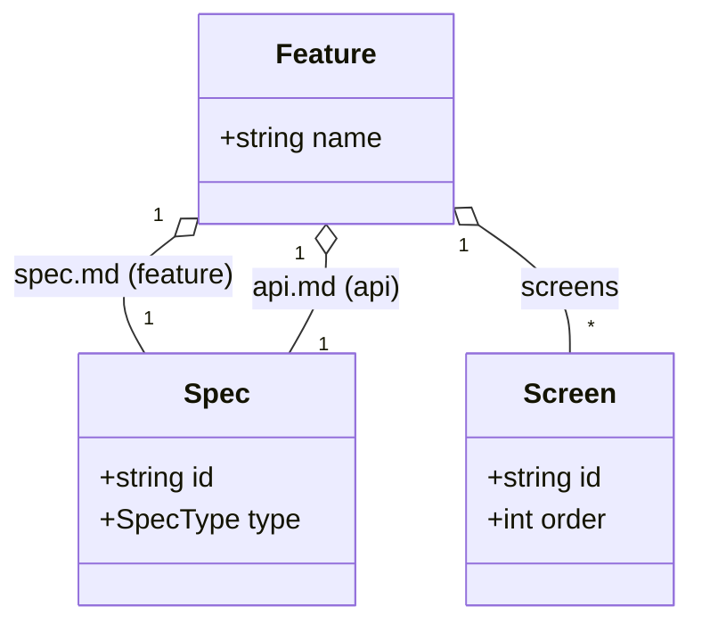

# Feature

## Description

機能 (`features/<name>/`) を表すアグリゲート。
1 つの feature 仕様 (`spec.md`, type=feature)、1 つの API 仕様 (`api.md`, type=api)、
複数の画面 ([Screen](Screen.md), `screens/`) を束ねる。

- `name`: feature 名（ディレクトリ名。英数字 `.` `_` `-`）

構成要素はすべて [Spec](Spec.md)（の特化）として表現される。

## Diagram

