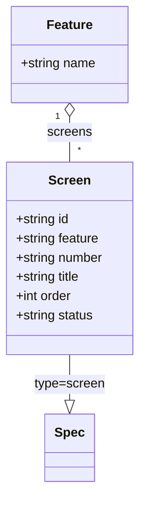

# Screen

## Description

画面仕様 (`features/<feature>/screens/S-00n.md`, type=screen) を表すモデル。
[Spec](Spec.md) の特化で、[Feature](Feature.md) に属する。

- `id`: specs/ からの相対パス
- `feature`: 所属する feature 名
- `number`: 画面番号（ファイル名先頭の `S-00n`、追加時に自動採番）
- `title`: 画面名（H1 見出し）
- `order`: feature 内の並び順（frontmatter の order。ドラッグ&ドロップで更新）
- `status`: frontmatter の status

## Diagram

