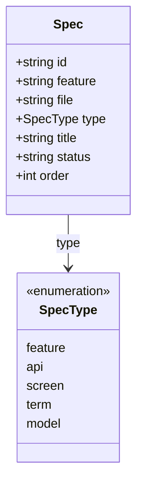

# Spec

## Description

仕様書 (specs/ 配下の 1 つの Markdown ファイル) を表す基底モデル。実装の `store.Spec` に対応する。
`type` によって役割が分かれ、`screen` などは Spec の特化として別モデルに切り出している。

- `id`: specs/ からの相対パス。一意キー（例: `features/user-login/spec.md`）
- `feature`: 所属する feature 名（domain エントリでは空）
- `file`: ファイル名（spec.md / api.yaml / S-00n.md / 用語名.md など）
- `type`: 種別。`feature` / `api` / `screen` / `term` / `model`
- `title`: 先頭の H1 見出し
- `status`: frontmatter の status（draft など）
- `order`: 並び順（screen で使用）

関連: [Feature](Feature.md)（spec.md / api.yaml / screens を束ねる）、[Screen](Screen.md)（type=screen の特化）。

## Diagram

